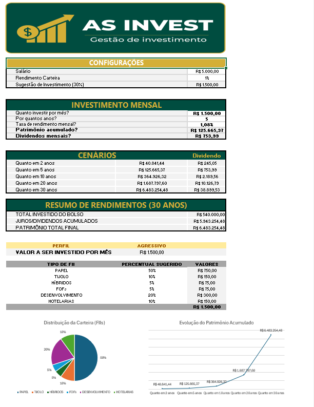

 
# 📊 Simulador de Investimentos em Fundos Imobiliários (FIIs)

Ferramenta prática desenvolvida em Excel para simulação de acúmulo de patrimônio, dividendos mensais e alocação estratégica de carteira em Fundos Imobiliários.

---

## 🎯 Objetivo do Projeto
O objetivo deste projeto é fornecer uma solução automatizada para auxiliar investidores no planejamento financeiro de longo prazo, permitindo visualizar:
- O impacto dos juros compostos ao longo do tempo (2 a 30 anos).
- A projeção de renda passiva mensal através de dividendos.
- A distribuição recomendada de carteira por tipo de FII (Papel, Tijolo, FOFs, etc.) de acordo com o perfil de risco.

---

## 🛠️ Funcionalidades e Estrutura
- **Configurações Iniciais:** Entrada dinâmica de salário, taxa de rendimento e percentual sugerido de aporte.
- **Simulador Interativo:** Cálculo automático do patrimônio acumulado e da renda mensal estimada com base em tempo e valor aportado.
- **Tabela de Cenários:** Visão comparativa temporal (2, 5, 10, 20 e 30 anos).
- **Alocação Inteligente:** Matriz de recomendação setorial ajustada por perfil de risco (Conservador, Moderado e Agressivo) utilizando `PROCV` e buscas condicionais.
- **Dashboards Visuais:**
  - Gráfico de linha demonstrando a evolução exponencial do patrimônio.
  - Gráfico de pizza com detalhamento percentual da alocação por tipo de fundo.

---

## 📈 Tecnologias e Conceitos de Excel Aplicados
- **Fórmulas Financeiras e Matemáticas:** Cálculo de montante com juros compostos (`VF`), multiplicações encadeadas e somas automáticas.
- **Funções de Busca e Lógica:** `PROCV` e formatação condicional.
- **Design de Dashboards:** Remoção de linhas de grade e barra de fórmulas para criação de uma interface limpa e intuitiva.

---

## 🖼️ Capturas de Tela

